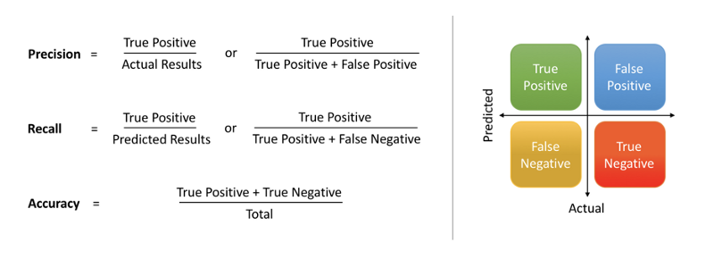

```{r setup, include=FALSE}
knitr::opts_chunk$set(echo = TRUE)
#rmarkdown::render('feature_engineering.Rmd')
```

```{r library, warning=FALSE, message=FALSE}
library(dplyr)
library(caret)
library(Metrics)
library(mice)
library(car)
library(rpart)
library(tree.bins)
```

## Feature Engineering

Feature engineering is the process of using domain knowledge of the data to create features that make machine learning algorithms work. Feature engineering is fundamental to the application of machine learning, and is both difficult and expensive. **The need for manual feature engineering can be obviated by automated feature learning.**

Feature engineering is an **informal topic**, but it is considered essential in applied machine learning.

*Coming up with features is difficult, time-consuming, requires expert knowledge. "Applied machine learning" is basically feature engineering.

  Andrew Ng, Machine Learning and AI via Brain simulations*
  
  
## Precision, Recall and Accuracy



```{r pra}


```


## Titanic Dataset

The sinking of the **RMS Titanic** is one of the most infamous shipwrecks in history.  On April 15, 1912, during her maiden voyage, the Titanic sank after colliding with an iceberg, killing 1502 out of 2224 passengers and crew. This sensational tragedy shocked the international community and led to better safety regulations for ships.

One of the reasons that the shipwreck led to such loss of life was that there were not enough lifeboats for the passengers and crew. Although there was some element of luck involved in surviving the sinking, some groups of people were more likely to survive than others, such as women, children, and the upper-class.

We could ask ourselves what sorts of people were likely to survive. In particular, we could apply the tools of machine learning to predict which passengers survived the tragedy.

```{r load_titanic}
train <- read.csv('train.csv', stringsAsFactors = F)
test <- read.csv('test.csv', stringsAsFactors = F)
test_labels <- test$PassengerId
test$Survived <- NA

str(train)
train$PassengerId <- NULL
set.seed(1997)
```

### Data Dictionary

**pclass**: A proxy for socio-economic status (SES)

* 1st = Upper
* 2nd = Middle
* 3rd = Lower

**age**: Age is fractional if less than 1. If the age is estimated, is it in the form of xx.5

**sibsp**: The dataset defines family relations in this way...

* Sibling = brother, sister, stepbrother, stepsister
* Spouse = husband, wife (mistresses and fiances were ignored)

**parch**: The dataset defines family relations in this way...

* Parent = mother, father
* Child = daughter, son, stepdaughter, stepson
* Some children travelled only with a nanny, therefore parch=0 for them.

## Random Forest 

Watch the youtube video below. For the video to appear you **NEED TO OPEN THE KNITTED HTML FILE IN A BROWSER LIKE FIREFOX/CHROME/IE**.

<div align="center">
<iframe width="560" height="315" src="https://www.youtube.com/embed/9TiezQ7Gb3M" frameborder="0" allowfullscreen></iframe>
</div>


## Exploratory Data Analysis (EDA)

We start with missing values, we see **Age** has few missing values (only variable with missing values).

```{r EDA}
# Missing Values
sapply(train, function(X) sum(is.na(X)))

# let's factorize categorical variables
train$Survived.F <- as.factor(train$Survived)
train$Survived <- NULL
train$Sex.F <- as.factor(train$Sex)
train$Sex <- NULL
train$Pclass.F <- as.factor(train$Pclass)
train$PClass <- NULL

# let's examine the three variables of interest

ggplot(train, aes(x=Pclass,fill=Survived.F)) + geom_bar() + labs(fill = "Survived") + labs(title="Survivor split by ticket class")

agebrackets <- c(0,13,18,30,55)
train$Agebracket <- findInterval(train$Age,agebrackets)
agetable <- data.frame(Agebracket=c(1,2,3,4,5),Age_range=c("<13","13-17","18-29","30-54","55+"))
train.age <- merge(train,agetable,by="Agebracket", all=TRUE)
train.age$Agebracket <- as.factor(train$Agebracket)

ggplot(train.age, aes(x=Age_range,fill=Survived.F)) + geom_bar() + labs(fill = "Survived") + labs(title="Survivor split by Age")

train$Agebracket <- NULL
train.age <- NULL


ggplot(train, aes(x=Sex.F,fill=Survived.F)) + geom_bar() + labs(fill = "Survived") + labs(title="Survivor split by Sex")

table(train$Cabin, useNA = 'always')
#table(train$Ticket, useNA = 'always')
train$Cabin[train$Cabin == ''] <- 'UN'
train$Cabin[train$Cabin != ''] <- substr(train$Cabin, 1 , 1)
table(train$Cabin)
train$Cabin.F <- as.factor(train$Cabin)
```

## Train/Test split

Because only Kaggle has the real labels for the **test** set and we may want to validate some our **imputation** and **balancing** we split the **train** set into a **train.sub** and **validation.sub** datasets using a 80/20 ration.

```{r trainvalidation}

## 80% of the sample size
smp_size <- floor(0.80 * nrow(train))
train_ind <- sample(seq_len(nrow(train)), size = smp_size)
 
split_train_val <- function(X) {   
  train.sub <- X[train_ind, ]
  validation.sub <- X[-train_ind, ]
  val_labels <- validation.sub$Survived.F
  validation.sub$Survived.F <- NULL
  return(list(train.sub, validation.sub, val_labels))
}

```

Notice this is our own train/test split and we are at mercy of randomness (how good/bad is this train/test split). 

The R package caret later on will create many **folds** to balance the train/test split, please look at this video on **cross validation**:

<div align="center">
<iframe width="560" height="315" src="https://www.youtube.com/embed/sFO2ff-gTh0" frameborder="0" allowfullscreen></iframe>
</div>

<div align="center">
<iframe width="560" height="315" src="https://www.youtube.com/embed/BEQdMea5usw" frameborder="0" allowfullscreen></iframe>
</div>


## ROC/AUC

<div align="center">
<iframe width="560" height="315" src="https://www.youtube.com/embed/xugjARegisk" frameborder="0" allowfullscreen></iframe>
</div>

## First Logistic Regression

Let's run a dummy regression with with the dataset **as it is** (simple imputation, no feature engineering). We cannot use the **Name** variable yet because it is effectively an ID (each row has a unique Name).

```{r first_regression}
# 4-fold CV 
fitControl <- trainControl(
  method = "cv",
  number = 4,
  savePredictions = TRUE,
  verboseIter=TRUE
)

table(train$Age, useNA = "always")
## imputation we simply take the average age
train$AgeImp1<- ifelse(is.na(train$Age), round(mean(train$Age, na.rm=TRUE)), train$Age)
table(train$AgeImp1, useNA = "always")


ret <- split_train_val(train)
train.sub <- ret[[1]]
validation.sub <- ret[[2]]
val_labels <- ret[[3]]


## Logistic regression
lreg  <- train(Survived.F ~ AgeImp1 + Sex.F + Pclass.F,data=train.sub,method="glm",family=binomial(),trControl=fitControl)
summary(lreg)

# let's now predict
lreg_pred <- predict(lreg, validation.sub)
confusionMatrix(lreg_pred, val_labels)
auc_val <- auc(val_labels, lreg_pred)
print(auc_val)

train$AgeImp1 <- NULL
```

## Second Logistic Regression

In the first logistic regression we imputed **Age** in a quite "silly" way just taking the average. Can we do better to guess the real Age? Would this bring better out-sample predictions?

One approach could be to regress the Age according to some potentially predictive features and then **impute** the missing **NA** values using the predictions from this regression. 

There is a lot in a name...

```{r second_regression}

tail(train[,c("Name","Age")], n=20)

train$Title <- gsub('(.*, )|(\\..*)', '', train$Name)
count(train,Title)

ggplot(data=train, aes(x=Title, fill=Survived.F)) + geom_bar() + theme(axis.text.x = element_text(angle = 90, hjust = 1))  + labs(title="Survivor split by Title")

mice_ages <- mice(train[, !names(train) %in% "Survived.F"], method='rf')
mice_out <- complete(mice_ages)
head(mice_out)
table(mice_out$Age, useNA = "always")

train$AgeImp2 <- mice_out$Age
tail(train[,c("Survived.F","Name","AgeImp2")], n=20)

ret <- split_train_val(train)
train.sub <- ret[[1]]
validation.sub <- ret[[2]]
val_labels <- ret[[3]]

## Logistic regression
lreg  <- train(Survived.F ~ AgeImp2 + Sex.F + Pclass.F,data=train.sub,method="glm",family=binomial(),trControl=fitControl)
summary(lreg)

# let's now predict
lreg_pred <- predict(lreg, validation.sub)
confusionMatrix(lreg_pred, val_labels)
auc_val <- auc(val_labels, lreg_pred)
print(auc_val)

```

## Third Logistic Regression

Notice now we have a new variable **Title** as well. Let's add it to the model. But also notice there are some levels with only one observation. Let's bin this variable.

What we will find out running this third regression is that the model is going to be affected by multicollinearity most likely between the variable **Title** level **Ms** and **Sex** level **Female** (not surprisingly). We can run a [**vif**](http://www.sthda.com/english/articles/39-regression-model-diagnostics/160-multicollinearity-essentials-and-vif-in-r/) test to detect this more formally.

Please refer also to [**vif**](https://cran.r-project.org/web/packages/olsrr/vignettes/regression_diagnostics.html)

```{r sthird_regression}
VIP <- c("Capt","Col","Don","Dona","Dr","Jonkheer","Lady","Major",
         "Mlle", "Mme","Rev","Sir","the Countess")

Title.orig <- train$Title
train$Title[train$Title %in% VIP] <- "VIP"
train$Title.F <- as.factor(train$Title)

ret <- split_train_val(train)
train.sub <- ret[[1]]
validation.sub <- ret[[2]]
val_labels <- ret[[3]]

## Logistic regression
lreg  <- train(Survived.F ~ AgeImp2 + Sex.F + Pclass.F + Title.F,data=train.sub,method="glm",family=binomial(),trControl=fitControl)
summary(lreg)

# let's now predict
lreg_pred <- predict(lreg, validation.sub)
confusionMatrix(lreg_pred, val_labels)
auc_val <- auc(val_labels, lreg_pred)
print(auc_val)

glm.model <- glm(Survived.F ~ AgeImp2 + Sex.F + Pclass.F + Title.F, data = train.sub, family = binomial())
vif(glm.model)


# put back the original Title given we have a multicollinearity problem
train$Title <- Title.orig
train$Title.F <- as.factor(train$Title)

```

This didn't quite work. As said earlier, it seems the level **TitleMs** is multicollinear with **Sex**. What can we do? One solution would be to remove one of the variable **Title** or **Sex** but Let's try a more advanced binning technique based on Random Forest using the **tree.bins** R package.

```{r binning_rf}
sample.df <- train %>% select(Survived.F, Title.F)
both <- tree.bins(data = sample.df, y = Survived.F, bin.nm = "bin#.", control = rpart.control(cp = .001), return = "both")
head(both$new.fctrs, n=10)
str(sample.df$Title.F)
train$Title.F <- both$new.fctrs$Title.F


# let's try again the regression
ret <- split_train_val(train)
train.sub <- ret[[1]]
validation.sub <- ret[[2]]
val_labels <- ret[[3]]

## Logistic regression
lreg  <- train(Survived.F ~ AgeImp2 + Sex.F + Pclass.F + Title.F,data=train.sub,method="glm",family=binomial(),trControl=fitControl)
summary(lreg)

# let's now predict
lreg_pred <- predict(lreg, validation.sub)
confusionMatrix(lreg_pred, val_labels)
auc_val <- auc(val_labels, lreg_pred)
print(auc_val)
```

The regression now works after **tree.bins** created two bins out of the **Title** variable and managed to increase the prediction power.

## Random Forest

Lastly we can run **Random Forest** on the same set of features/variables to check if we can have a better prediction (the model at this stage is very simple so we may not have any real improvement, as the old adage goes **"do not use a sledgehammer to crack a nut"**)

```{r rf, fig.height=18, fig.width=30}
lrf  <- train(Survived.F ~ AgeImp2 + Sex.F + Pclass.F + Title.F,data=train.sub,method="rf",family=binomial(),trControl=fitControl, tuneGrid = data.frame(mtry = 5))
lrf

plot(lrf$finalModel)

# let's now predict
lrf_pred <- predict(lrf, validation.sub)
confusionMatrix(lrf_pred, val_labels)
auc_val <- auc(val_labels, lrf_pred)
print(auc_val)

# Let's use a slightly different rf library to plot the potential tree
preProcessInTrain<-c("center", "scale")
metric_used<-"Accuracy"
model <- train(
  Survived.F ~ AgeImp2 + Sex.F + Pclass.F + Title.F, data = train,
  method = "rpart",
  trControl = fitControl,
  metric=metric_used,
  tuneLength = 10,
  preProc = preProcessInTrain
)
library(rpart.plot)
rpart.plot(model$finalModel)

```

## Age Binning

So far we bin to "join" levels but maintain the same statistical property of the overall feature distribution (**tree.bins**).

We could also bin the **Age** variable in brackets to check if we can improve the overall predictions.

```{r age_binning}

AgeBracketF<-function(X){
  if(X > 50){
    return("old")
  } 
  else if(X<=50 & X>18){
   return("adult")
  }
  else if(X<=18 & X>13){
   return("teenager")
  }
  else{
    return("child")
  }
}

train$AgeBracket<- sapply(train$AgeImp2, function(X) AgeBracketF(X))
train$AgeBracket.F <- as.factor(train$AgeBracket)

# let's try again the regression
ret <- split_train_val(train)
train.sub <- ret[[1]]
validation.sub <- ret[[2]]
val_labels <- ret[[3]]

## Logistic regression
lreg  <- train(Survived.F ~ AgeBracket.F + Sex.F + Pclass.F + Title.F,data=train.sub,method="glm",family=binomial(),trControl=fitControl)
summary(lreg)

# let's now predict
lreg_pred <- predict(lreg, validation.sub)
confusionMatrix(lreg_pred, val_labels)
auc_val <- auc(val_labels, lreg_pred)
print(auc_val)

```
### Cabin
```{r Cabin}

## Logistic regression
table(train$Ticket)

lreg  <- train(Survived.F ~ AgeBracket.F + Pclass.F + Title.F + Fare,data=train.sub,method="glm",family=binomial(),trControl=fitControl)
summary(lreg)

# let's now predict
lreg_pred <- predict(lreg, validation.sub)
confusionMatrix(lreg_pred, val_labels)
auc_val <- auc(val_labels, lreg_pred)
print(auc_val)
```

## Conclusions

In this lecture we investigated some powerful way to **impute** and **binning** data. 